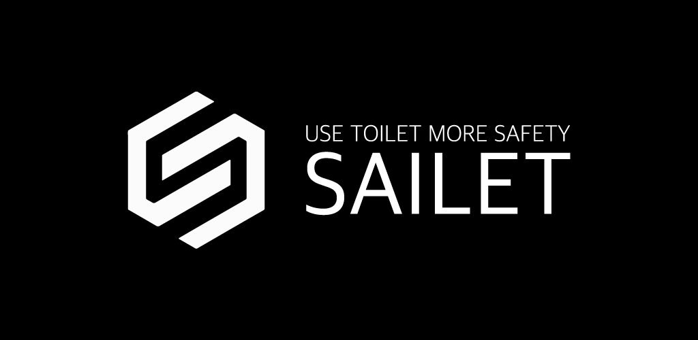

# 안전한 화장실, SAILET.

> 공공화장실 위치 기반 서비스
##### [Play Store](https://bit.ly/sailetand) / [App Store](https://apple.co/39jBNgP)

### Project folder structure
``` bash
sailet
├── apk         -------> # apk output directory
├── app         -------> # native app with React Native
├── backend     -------> # Backend API with Prisma & graphql-yoga
├── map         -------> # map for native app webview
└── web         -------> # web for dynamic links & QR Code
```

## Getting Started

### Prerequisites
- NPM
- yarn
- CocoaPods

### Run in development
#### Run Native APP
``` bash
cd app

# install dependencies
yarn install 

# iOS : Build
cd ios && pod install

# iOS : Running On Simulator
npx react-native run-ios

# Android : Running On MD
# Preparing the Android device or AVD
npx react-native run-android
```

#### Run backend server
``` bash
cd backend

# install serverless framework globally
yarn global add serverless 

# install dependencies
yarn install

# Running at localhost:4000
serverless offline --port 4000
```

#### Run web & map front server
``` bash
cd web(map)

# install dependencies
yarn install 

# Running at localhost:3000
yarn start
```


## License
MIT License

Copyright 2019 Lee Seungmin. All rights reserved.
